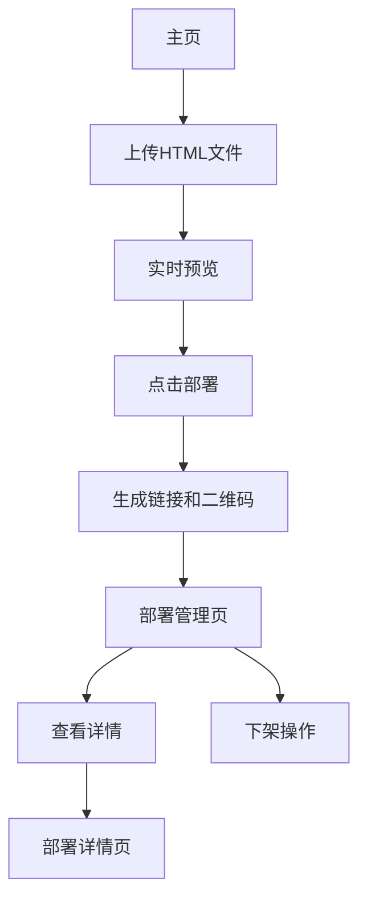

## 1. Product Overview
HTML Preview & Deployer 是一个简单易用的HTML文件预览和部署工具。用户可以快速上传HTML文件进行实时预览，并一键部署到网页端生成可访问的链接和二维码。

该工具解决了开发者和设计师需要快速分享HTML作品的需求，让任何人都能轻松将本地HTML文件变成可在线访问的网页，无需复杂的服务器配置。

## 2. Core Features

### 2.1 User Roles
本产品为单用户工具，无需区分用户角色，所有功能对所有用户开放。

### 2.2 Feature Module
我们的HTML预览和部署工具包含以下主要页面：
1. **主页**：文件上传、实时预览、部署按钮。
2. **部署管理页**：部署历史列表、分类筛选、下架操作。
3. **部署详情页**：访问链接、二维码展示、部署信息。

### 2.3 Page Details
| Page Name | Module Name | Feature description |
|-----------|-------------|---------------------|
| 主页 | 文件上传模块 | 支持拖拽或点击上传HTML文件，显示文件名称和大小。 |
| 主页 | 实时预览模块 | 在上传后立即显示HTML渲染效果，支持刷新预览。 |
| 主页 | 部署操作模块 | 一键部署按钮，生成唯一访问代码，显示部署状态。 |
| 部署管理页 | 历史列表模块 | 展示所有部署记录，包含标题、部署时间、访问次数。 |
| 部署管理页 | 分类筛选模块 | 按时间、状态、访问次数等方式筛选部署记录。 |
| 部署管理页 | 操作模块 | 提供下架、查看详情、复制链接等功能按钮。 |
| 部署详情页 | 访问信息模块 | 显示完整的访问链接，支持一键复制。 |
| 部署详情页 | 二维码模块 | 生成并展示对应链接的二维码，支持下载保存。 |
| 部署详情页 | 统计信息模块 | 显示创建时间、最后访问时间、总访问次数。 |

## 3. Core Process
用户操作流程：
1. 用户进入主页，上传HTML文件
2. 系统自动预览HTML内容
3. 用户点击部署按钮
4. 系统生成唯一访问代码和链接
5. 显示部署成功页面，包含链接和二维码
6. 用户可以在管理页面查看所有部署历史
7. 支持随时下架已部署的内容

## 4. User Interface Design

### 4.1 Design Style
- **主色调**：蓝色系（#3B82F6）作为主色，灰色系作为辅助色
- **按钮样式**：圆角矩形，悬停效果，主要操作用实心按钮
- **字体**：系统默认字体，标题16-18px，正文14px
- **布局风格**：卡片式布局，顶部导航，主要内容居中显示
- **图标风格**：使用简洁的线性图标，符合现代设计趋势

### 4.2 Page Design Overview
| Page Name | Module Name | UI Elements |
|-----------|-------------|-------------|
| 主页 | 文件上传区域 | 虚线边框的拖拽区域，中央显示上传图标和提示文字，支持拖拽高亮效果。 |
| 主页 | 预览区域 | 白色背景的iframe容器，高度400px，带边框阴影，顶部有刷新按钮。 |
| 主页 | 部署按钮 | 蓝色大按钮，居中显示，部署时显示加载动画。 |
| 部署管理页 | 列表项 | 卡片式设计，包含标题、时间、状态标签，右侧操作按钮组。 |
| 部署管理页 | 筛选栏 | 下拉选择器和搜索框组合，简洁的筛选控件。 |
| 部署详情页 | 二维码展示 | 居中显示的二维码图片，下方显示短链接，提供下载按钮。 |

### 4.3 Responsiveness
采用桌面端优先的设计方案，适配1200px以上屏幕。在移动端保持基本可用性，主要功能都能正常使用，但界面布局为桌面端优化。