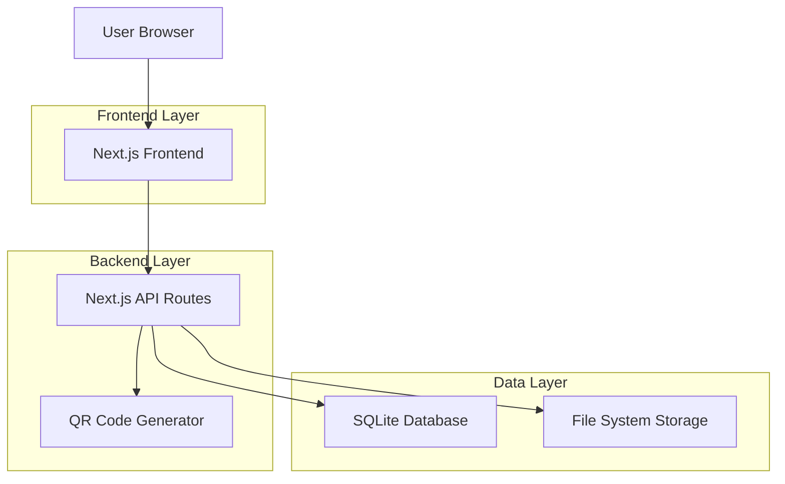
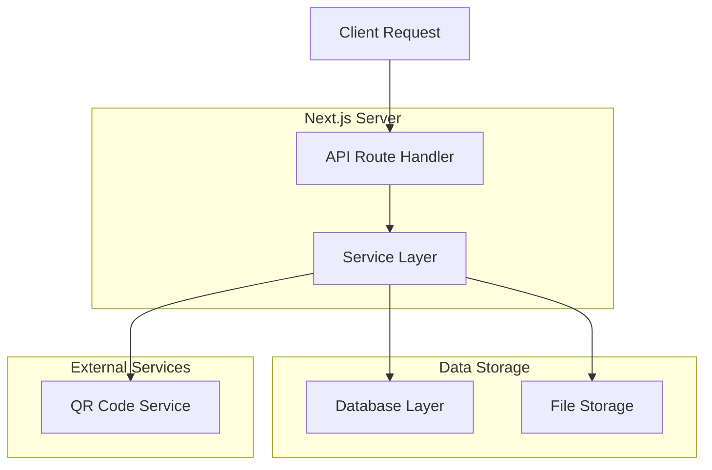
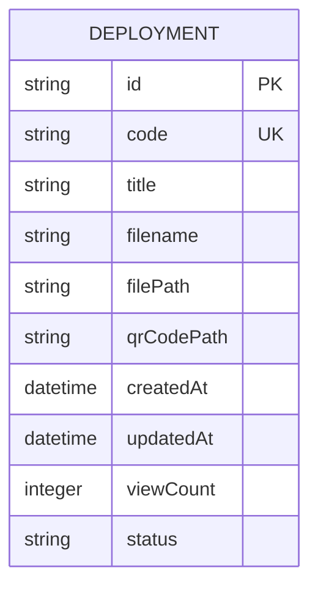

## 1. Architecture design



## 2. Technology Description
- Frontend: Next.js@14 + React@18 + TypeScript
- Styling: Tailwind CSS@3
- Backend: Next.js API Routes (全栈方案)
- Database: SQLite (本地文件数据库)
- 文件存储: 本地文件系统
- 二维码生成: qrcode@1.5
- 初始化工具: create-next-app

## 3. Route definitions
| Route | Purpose |
|-------|---------|
| / | 主页，文件上传和预览 |
| /deploy | 部署管理页面 |
| /deploy/[id] | 部署详情页面 |
| /s/[code] | 部署的HTML访问链接 |
| /api/upload | 文件上传API |
| /api/deploy | 部署操作API |
| /api/deploys | 获取部署列表API |
| /api/deploy/[id] | 部署详情和下架API |

## 4. API definitions

### 4.1 文件上传 API
```
POST /api/upload
```

Request:
| Param Name | Param Type | isRequired | Description |
|------------|------------|------------|-------------|
| file | File | true | HTML文件 |

Response:
| Param Name | Param Type | Description |
|------------|------------|-------------|
| success | boolean | 上传状态 |
| content | string | HTML内容 |
| filename | string | 文件名 |

### 4.2 部署创建 API
```
POST /api/deploy
```

Request:
| Param Name | Param Type | isRequired | Description |
|------------|------------|------------|-------------|
| content | string | true | HTML内容 |
| filename | string | true | 文件名 |
| title | string | false | 部署标题 |

Response:
| Param Name | Param Type | Description |
|------------|------------|-------------|
| success | boolean | 部署状态 |
| id | string | 部署ID |
| code | string | 访问代码 |
| url | string | 访问链接 |
| qrCode | string | 二维码数据URL |

### 4.3 部署列表 API
```
GET /api/deploys
```

Response:
| Param Name | Param Type | Description |
|------------|------------|-------------|
| deploys | array | 部署列表 |
| total | number | 总数 |

### 4.4 部署详情 API
```
GET /api/deploy/[id]
```

Response:
| Param Name | Param Type | Description |
|------------|------------|-------------|
| id | string | 部署ID |
| title | string | 标题 |
| code | string | 访问代码 |
| url | string | 访问链接 |
| qrCode | string | 二维码 |
| createdAt | string | 创建时间 |
| viewCount | number | 访问次数 |
| status | string | 状态 |

## 5. Server architecture diagram



## 6. Data model

### 6.1 Data model定义


### 6.2 Data Definition Language
部署表（deployments）
```sql
-- 创建表
CREATE TABLE deployments (
    id TEXT PRIMARY KEY,
    code TEXT UNIQUE NOT NULL,
    title TEXT NOT NULL,
    filename TEXT NOT NULL,
    filePath TEXT NOT NULL,
    qrCodePath TEXT NOT NULL,
    createdAt DATETIME DEFAULT CURRENT_TIMESTAMP,
    updatedAt DATETIME DEFAULT CURRENT_TIMESTAMP,
    viewCount INTEGER DEFAULT 0,
    status TEXT DEFAULT 'active' CHECK (status IN ('active', 'inactive'))
);

-- 创建索引
CREATE INDEX idx_deployments_code ON deployments(code);
CREATE INDEX idx_deployments_createdAt ON deployments(createdAt DESC);
CREATE INDEX idx_deployments_status ON deployments(status);

-- 初始化数据（可选）
-- INSERT INTO deployments (id, code, title, filename, filePath, qrCodePath) 
-- VALUES ('1', 'abc123', '示例页面', 'example.html', '/uploads/abc123.html', '/qrcodes/abc123.png');
```

文件存储结构：
```
project-root/
├── public/
│   ├── uploads/     # HTML文件存储
│   │   └── {code}.html
│   └── qrcodes/    # 二维码图片存储
│       └── {code}.png
├── data/
│   └── database.db  # SQLite数据库文件
└── ...
```